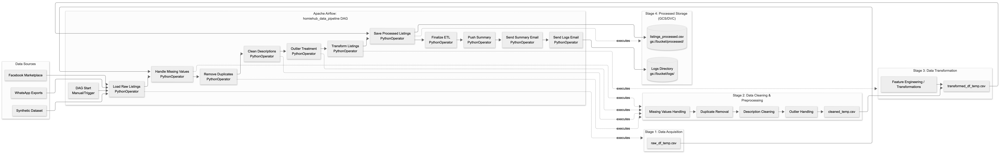
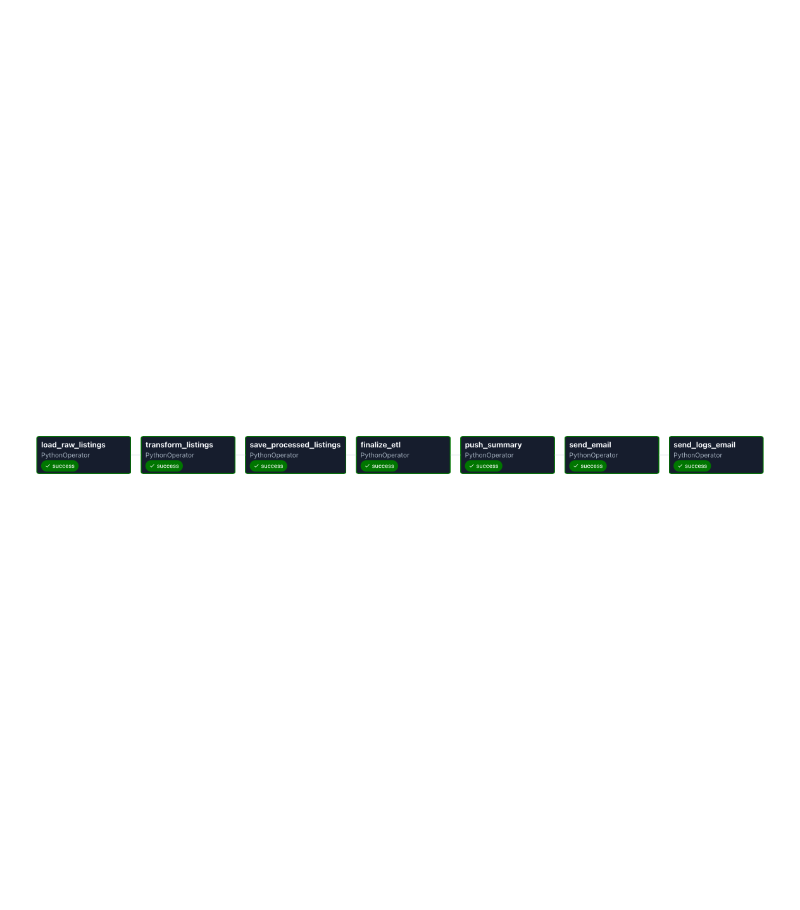
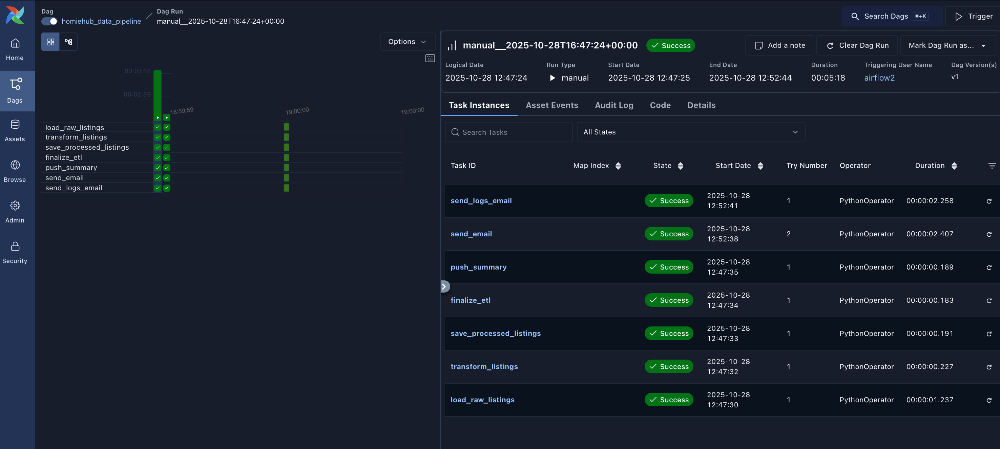
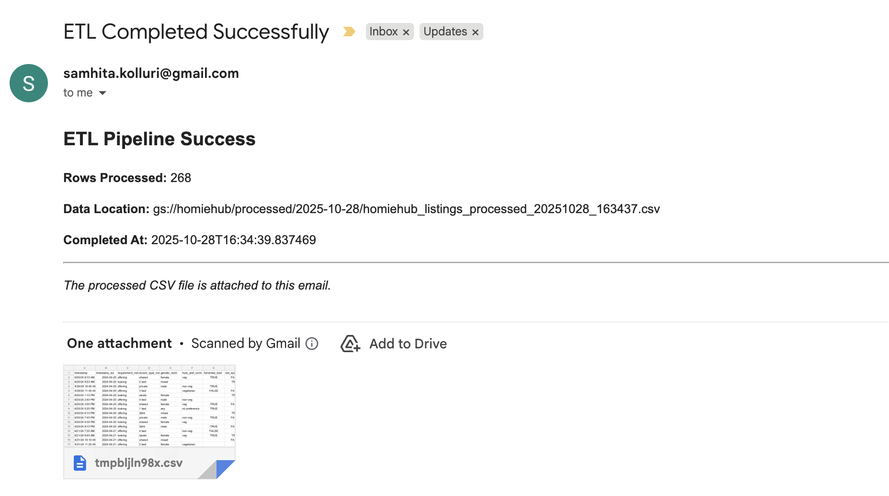
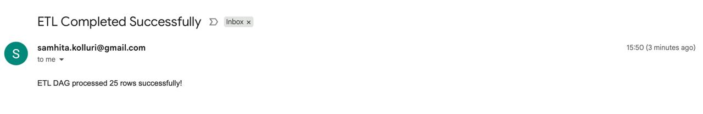
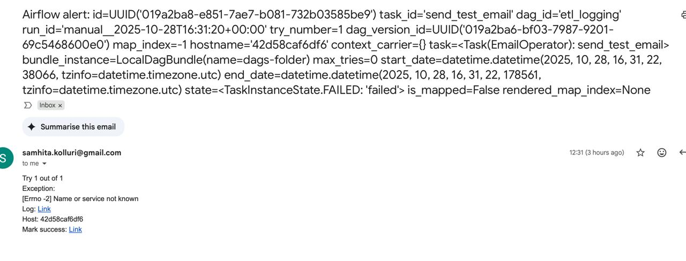
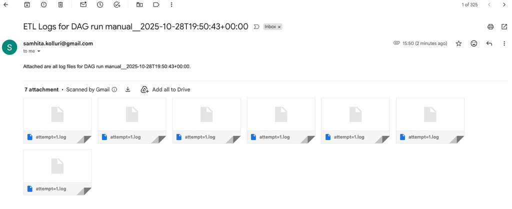
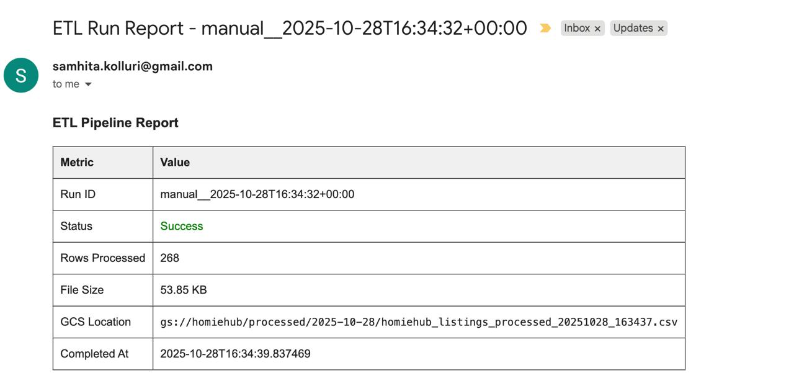

#  **HomieHub Data Pipeline**

## **1. Project Overview**
HomieHub is an automated, end-to-end ETL pipeline designed to process **unstructured housing-related data (such as WhatsApp listings)** into **structured, verified, and normalized datasets** ready for analysis.  

This project demonstrates **modern MLOps practices**, including:
- Modular and reusable code structure
- **Airflow-based orchestration**
- **Dockerized reproducibility**
- Automated **logging, versioning, and testing**
--- 
## Key Features

* Modular ETL code: `extraction`, `ingestion`, `load`, `preprocessing`, and `utils`
* Reproducible workflow using **Docker** and **Airflow**
* Logging and alert system for monitoring pipeline execution
* Data versioning using **DVC**
* SMTP email notifications for ETL summary and logs
* Supports anomaly detection and schema validation in preprocessing
--- 
## Folder Structure

```text
homiehub/
├── LICENSE
├── README.md                         # Main project documentation
├── requirements.txt                  # Project-wide dependencies
└── data-pipeline/                    # Data Pipeline Module
    ├── ETL_SCRIPT.sh                 # Manual ETL execution script
    ├── README.md                     # Pipeline-specific documentation
    ├── airflow_setup.sh              # Airflow environment setup script
    ├── requirement.txt               # Pipeline-specific dependencies
    ├── __init__.py
    ├── assets/                       # Documentation assets
    │   ├── 0_flowchart_datapipeline.png
    │   ├── 1_grant_chart.png
    │   ├── 2_homiehub_data_pipeline-graph.png
    │   ├── 3_email_errorlog.png
    │   ├── 3_email_logs.png
    │   ├── 3_email_notify.png
    │   ├── 3_email_successlog.png
    │   └── 4_dag_report.png
    ├── dags/                         # Airflow DAG definitions
    │   ├── __init__.py
    │   └── homiehub_data_pipeline.py
    ├── data/                         # Data storage (DVC tracked)
    │   ├── processed/
    │   │   └── homiehub_listings_processed.csv.dvc
    │   └── raw/
    │       └── homiehub_listings.csv.dvc
    ├── docs/                         # Pipeline documentation
    ├── scripts_guide.md               # scripts guide
    │   ├── setup_guide.md                # setup guide
    ├── pipelines/                    # Core pipeline logic
    │   ├── __init__.py
    │   └── etl.py
    ├── plugins/                      # Airflow plugins
    ├── src/                          # Source code modules
    │   ├── __init__.py
    │   ├── extraction/               # Data extraction
    │   │   ├── __init__.py
    │   │   ├── upload_script_to_GCP.py
    │   │   └── whatsapp_data_extraction.py
    │   ├── ingestion/                # Data ingestion
    │   │   ├── __init__.py
    │   │   └── data_handlers/
    │   │       ├── __init__.py
    │   │       └── csv_extractor.py
    │   ├── load/                     # Data loading to GCS
    │   │   ├── __init__.py
    │   │   └── upload_cleaned_df_to_gcp.py
    │   ├── preprocessing/            # Data transformation
    │   │   ├── __init__.py
    │   │   └── transform.py
    │   │   └── bias.py
    │   └── utils/                    # Utility functions
    │       ├── __init__.py
    │       ├── io.py
    │       └── logger.py
    ├── test/                         # Test suite
    │   ├── __init__.py
    │   ├── test_data_extraction.py
    │   ├── test_data_loading.py
    │   └── test_data_transformation.py
    └── working_data/                 # Temporary processing directory
        └── __init__.py
```
----
## **2. Pipeline Architecture**

### **2.1 End-to-End Pipeline Flow**
The following flowchart illustrates the **complete ETL pipeline**, detailing how data moves from unstructured sources (e.g., WhatsApp exports or Facebook Marketplace listings) through Airflow-orchestrated tasks into cleaned, versioned outputs:



**Flow Overview:**
- **Stage 1 – Data Acquisition:** Collects housing data from WhatsApp, Facebook Marketplace, or synthetic test datasets.  
- **Stage 2 – Data Cleaning & Preprocessing:** Handles missing values, removes duplicates, and performs outlier treatment.  
- **Stage 3 – Data Transformation:** Applies feature engineering, categorical normalization, and value conversions.  
- **Stage 4 – Processed Storage:** Stores validated outputs in `data/processed/`, logs in `logs/`, and triggers summary emails.  

All stages are orchestrated by the Airflow DAG: `homiehub_data_pipeline.py`.

### **2.1 DAG Overview**
The entire workflow is orchestrated through **Apache Airflow** using the DAG file:  
`dags/homiehub_data_pipeline.py`.

**Tasks:**  
`Extract → Ingest → Transform → Save → Push Summary → Email Notification`

**Key Features:**
- Automatic scheduling (daily or manual)
- Retries and alert notifications on failure
- Modular task definitions for reproducibility

**Visualization:**


---

### **2.2 Workflow Timeline**
The runtime dependencies and task sequence are represented below:



This Gantt chart visualizes the task execution order and timing dependencies within the Airflow DAG.

**homiehub_data_pipeline DAG** consists of the following steps:

1. **Load Raw Listings** – reads raw CSV into a temporary file
2. **Transform Listings** – data cleaning, preprocessing, and feature engineering
3. **Save Processed Listings** – outputs cleaned CSV to `data/processed/`
4. **Finalize ETL** – prints ETL completion in logs
5. **Push Summary** – generates ETL summary for XCom and notifications
6. **Send Summary Email** – sends success/failure summary via SMTP
7. **Send Logs Email** – emails logs for the current DAG run.

----
## **3. Data Acquisition and Ingestion**

### **Extraction**
- **Script:** `src/extraction/whatsapp_data_extraction.py`
- **Purpose:** Converts unstructured WhatsApp chat exports into structured CSVs.  
- **Output:** `data/raw/structured_listings_nlp.csv`

### **Ingestion**
- **Script:** `src/ingestion/data_handlers/csv_extractor.py`
- **Purpose:** Reads the structured CSV safely into a pandas DataFrame.  
- **Validations:**  
  - Confirms file presence and schema consistency  
  - Applies safe NA handling and type inference  

**Result:** A traceable, clean ingestion process from raw text → structured CSV → pandas DataFrame.

---- 
## **4. Data Preprocessing and Transformation**
### **Transformation**
- **Script:** `src/preprocessing/transform.py`
- **Core Tasks:**
  - Normalizes categorical fields (`gender`, `accom_type`, `food_pref`, `area`)
  - Converts monetary fields to numeric (`rent_amount_num`)
  - Parses boolean flags (`furnished_bool`, `utilities_included_bool`)
  - Parses dates and derives ISO timestamps (`timestamp_iso`)
  - Computes helper fields like `lease_duration_months`

**Output:**  
A fully cleaned, analysis-ready dataset stored in `/data/processed/`.

**Reproducibility:**  
Every transformation step is deterministic — identical input yields identical output.

### **Bias Detection and Mitigation**
- **Script:** `src/preprocessing/bias.py`
- **Purpose:** Analyzes and mitigates demographic bias in housing listings
- **Core Tasks:**
  - Detects bias across sensitive features (gender, area, food preferences)
  - Analyzes data distribution imbalances
  - Performs slice-based performance analysis
  - Implements mitigation strategies (resampling)
  - Generates bias analysis reports
- **Output:** 
  - Bias metrics and visualizations in GCS
  - Mitigated dataset in `bias_analysis/` folder
--- 
## **5. Error Handling and Resilience**

- **Retries:** Configured per task (2 attempts, 3-minute delay)
- **Failure Alerts:** Triggered via Airflow `EmailOperator`
- **Graceful Degradation:**  
  - If extraction fails, the DAG halts with descriptive logs  
  - Empty data files still maintain headers for downstream compatibility
- **Success Alerts:** Summaries with record counts sent via email upon completion

---
## **6. Logging and Monitoring**

The pipeline leverages **Airflow’s built-in logging and monitoring**, enhanced with email notifications.

### **6.1 Logging Features**
- Each task logs start/end timestamps and row counts.
- Logs are saved under `logs/` and attached to summary emails.
- Task-level logs can also be viewed directly in the Airflow UI.

### **6.2 Monitoring**
- Airflow tracks task status and run duration.
- Completion summaries and statistics are emailed to administrators.
- DAG execution reports available in Airflow UI.

### **6.3 Email Notifications**



**Logs and Notification Types:**
1. Success Reports: ETL completion with metrics.
2. Failure Alerts: Detailed error traces.
3. Log Bundles: Attached .log files for auditing.
4. Bias Analysis Reports: Fairness metrics and mitigation summaries.

| Type | Image | Description |
|------|--------|-------------|
|  Success Email |  | “ETL Completed Successfully – Processed 25 Rows.” |
|  Failure Alert |  | Detailed trace for failure cases |
|  Log Bundle |  | Attached `.log` files per task for auditing |

**DAG Execution Report**



The DAG report shows:
- Task execution timeline
- Success/failure status per task
- Performance metrics
- Resource utilization

---
### **6.4 SMTP Email Configuration**

Security Best Practice:
Store email credentials in `.env.local` (never commit to Git)

```text
SMTP_USER=your_email@gmail.com
SMTP_PASSWORD=your_app_password  # Use Gmail App Password
ALERT_EMAIL=recipient@example.com
```
Check out [Scripts usage document](/data-pipeline/docs/scripts_usage.md) for more info.

**Airflow UI Configuration**

Navigate to `Admin` → `Connections` → Add `smtp_default` in Airflow UI:

| Field       | Value                                                                             |
| ----------- | --------------------------------------------------------------------------------- |
| Conn Id     | smtp_default                                                                      |
| Conn Type   | SMTP                                                                              |
| Host        | smtp.gmail.com                                                                    |
| Port        | 587                                                                               |
| Login       | (`your_email@gmail.com`) |
| Password    | `your_app_password`                                                     |
| Timeout     | 30                                                                                |
| Retry Limit | 5                                                                                 |
| TLS         | false                                                                             |
| SSL         | true                                                                              |
| Auth Type   | basic                                                                             |
---
Note: Use Gmail App Password, not your login password. Enable 2-Step Verification and generate an app-specific password.

---
## **7. Schema Validation and Data Quality**

HomieHub validates schema integrity and computes summary statistics automatically during ETL.

### **7.1 Schema Checks**
- Validates presence of all mandatory columns:  
  `['timestamp', 'rent_amount', 'gender', 'accom_type', 'food_pref', 'area']`
- Ensures data type consistency for numeric, boolean, and categorical columns.
- Logs missing or unexpected columns as warnings.

### **7.2 Statistics Generation**
Included automatically in the ETL summary email:
```
ETL Summary:
- Rows processed: 25
- Columns validated: 12
- Missing values: 0.8%
- Average Rent: $1,320.50
- Outlier threshold breaches: 0
- Bias Detection Results:
  - Gender disparity: 12.5%
  - Area disparity: 8.3%
  - Food preference disparity: 5.1%
  - Mitigation applied: Yes/No
```

These validations ensure high data quality, reproducibility, and schema stability across runs.

---

## **8. Testing and Validation**

Automated tests ensure **robustness**, **reproducibility**, and **edge-case resilience** across the pipeline.

### **Framework**
All tests are written in **pytest** and stored in `/tests/`.

### **Modules Covered**
| Test Script | Description |
|--------------|--------------|
| `test_data_extraction.py` | Validates extraction from GCS; checks schema, nulls, and data consistency. |
| `test_data_loading.py` | Tests ingestion, GCS upload/download consistency, and data structure preservation. |
| `test_data_transformation.py` | Unit-tests each preprocessing function (`_parse_money`, `_parse_bool`, `_parse_date`, etc.) and ensures correct column creation. |

### **Execution**
```bash
pytest -v
```

### **Key Assertions**
- Schema consistency between raw and processed datasets  
- Correct parsing of numerics, booleans, and dates  
- Deterministic outputs across repeated runs  
- Robust handling of malformed or missing input data
--- 
## **9. Data Versioning and Reproducibility**
HomieHub uses DVC integrated with Google Cloud Storage for data versioning and reproducibility.

### **9.1 Data Version Control (DVC)**
Used to version and reproduce datasets tied to specific DAG runs.

**Setup and configuration**
```bash
cd data-pipeline

# Initialize DVC
dvc init

# Configure GCS as remote storage
dvc remote add -d gcs_remote gs://homiehub-data-bucket/dvc-store
dvc remote modify gcs_remote credentialpath ./GCP_Account_Key.json

# Track data files
dvc add data/raw/homiehub_listings.csv
dvc add data/processed/homiehub_listings_processed.csv

# Commit DVC files to Git
git add data/raw/*.dvc data/processed/*.dvc .dvc/config
git commit -m "Add data versioning with DVC"

# Push data to GCS
dvc push
```

**Daily Pipeline Integration:**
```bash
# After each successful pipeline run
dvc add data/processed/homiehub_listings_processed.csv
git add data/processed/*.dvc
git commit -m "Update processed data: $(date +%Y-%m-%d)"
dvc push
```

**Team Collaboration:**
```bash
# Pull latest data version
git pull
dvc pull

# Check data history
git log --oneline -- data/processed/*.dvc

# Restore previous version
git checkout <commit-hash> data/processed/*.dvc
dvc checkout
```
**Purpose:**
- Maintain dataset lineage
- Guarantee reproducible pipeline states
- Sync exact dataset versions across collaborators.
- Cloud storage integration with GCS.
- Version history for all data transformations.
- Efficient storage (only diffs stored).

**Tracked Artifacts:** `data/raw/` and `data/processed/`

### **9.2 Reproducing the Project**

### **Quick Start**

1. **Clone the repository:**
   ```bash
   git clone https://github.com/homiehub/homiehub.git
   cd homiehub/data-pipeline
   ```

2. **Run the setup script:**
   ```bash
   chmod +x airflow_setup.sh
   ./airflow_setup.sh
   ```

3. **Configure environment:**
   ```bash
   # Create .env file
   echo "AIRFLOW_UID=501" >> .env
   echo "AIRFLOW_HOME=./airflow" >> .env
   echo "GCP_PROJECT_ID=your-project-id" >> .env
   echo "GCP_BUCKET_NAME=homiehub-data-bucket" >> .env
   echo "GOOGLE_APPLICATION_CREDENTIALS=./GCP_Account_Key.json" >> .env
   
   # Create .env.local for secrets (DO NOT COMMIT)
   echo "SMTP_USER=your-email@gmail.com" >> .env.local
   echo "SMTP_PASSWORD=your-app-password" >> .env.local
   echo "ALERT_EMAIL=recipient@example.com" >> .env.local
   ```

4. **Add GCP credentials:**
   ```bash
   cp /path/to/your-service-account-key.json ./GCP_Account_Key.json
   ```

5. **Initialize and start Airflow:**
   ```bash
   docker-compose up airflow-init
   docker-compose up -d
   ```

6. **Access Airflow UI:**
   - URL: http://localhost:8080
   - Username: airflow2
   - Password: airflow2

7. **Add your input data:**
   ```bash
   cp /path/to/your-data.csv data/raw/
   ```

8. **Trigger the DAG:**
   - Navigate to Airflow UI
   - Find `homiehub_data_pipeline` DAG
   - Toggle ON → Click **Trigger DAG**

### **Monitor Execution**
- View real-time logs in Airflow UI
- Check email for ETL summary reports
- Monitor `logs/` directory for detailed logs

### **DVC Operations**
```bash
# Pull existing data versions
dvc pull

# After pipeline runs, push new versions
dvc add data/raw data/processed
dvc push
git add data/*.dvc
git commit -m "Update data versions"
git push
```

### **Clean Re-run**
For deterministic re-execution:
```bash
# Stop services
docker-compose down -v

# Clean previous outputs
rm -rf logs/* data/processed/*

# Rebuild and restart
docker-compose up -d --build
```

---
## **10. Anomaly Detection and Alert Generation**

### **10.1 Implemented Anomaly Detection**

The HomieHub pipeline includes comprehensive anomaly detection specifically designed for housing listing data from WhatsApp sources.

#### **Schema Validation**
The pipeline validates schema on every run:
```python
# In src/preprocessing/transform.py
def validate_schema(df):
    required_cols = ['timestamp', 'rent_amount', 'area']
    missing = [col for col in required_cols if col not in df.columns]
    if missing:
        error_msg = f"Schema violation: Missing columns {missing}"
        logging.error(error_msg)
        raise ValueError(error_msg)
    return True
```

#### **Missing Value Detection**
Tracked and reported in ETL summary emails:
```python
# Included in pipeline summary
missing_stats = df.isnull().sum()
missing_pct = (missing_stats / len(df) * 100).round(2)
logging.info(f"Missing value percentages:\n{missing_pct}")
```

#### **Data Quality Checks**
Built into the transformation pipeline:
- Empty datasets trigger alerts
- Malformed data logged and handled
- Row count validation

### **10.2 Alert Generation System**

**Implemented Alert Channels:**

| Alert Type | Channel | Trigger | Implementation |
|------------|---------|---------|----------------|
| **Pipeline Failure** | Email | Task failure after retries | Airflow EmailOperator |
| **Data Quality Warning** | Email | >50% missing critical field | ETL summary email |
| **Schema Violation** | Email + Logs | Required columns missing | Exception + alert |
| **Processing Complete** | Email | Successful run | Summary with metrics |

**Email Alert Configuration:**
```python
# In dags/homiehub_data_pipeline.py
default_args = {
    'email': ['configured in .env.local'],
    'email_on_failure': True,
    'email_on_retry': False,
    'email_on_success': True,
}
```

### **10.3 Housing-Specific Anomaly Handling**

**Understanding WhatsApp Listing Patterns:**

| Pattern | Detection | Action | Reasoning |
|---------|-----------|--------|-----------|
| Rent = $0 | Logged | Mark as "Contact for price" | Common practice for privacy |
| Missing address | Tracked | Use neighborhood only | Safety concern from users | |
| Missing utilities | Counted | Default: tenant pays | Industry standard |
| No contact info | Logged | Use platform messaging | Platform handles contact |

**Why We Don't "Fix" These Anomalies:**
- User autonomy: Sellers choose what to share
- Market reality: "Contact for price" is standard practice
- Privacy respect: Not all sellers want to share full details
- Data integrity: Preserving original intent over synthetic completeness

### **10.4 Anomaly Monitoring Dashboard**

**Via Airflow UI:**
- Real-time task monitoring
- Failed task alerts
- Execution time anomalies
- Resource usage spikes

**Via Email Reports:**

1. **Email Notifications** - See `assets/3_email_notify.png`
2. **DAG Monitoring** - See `assets/4_dag_report.png`
3. **Log Files** - Available in `logs/` directory
4. **Test Coverage** - See `test/test_data_transformation.py`

### **10.5 Alert Response Protocol**

| Severity | Response Time | Action |
|----------|--------------|--------|
| **CRITICAL** | Immediate | Email + Pipeline stops |
| **WARNING** | End of run | Included in summary email |
| **INFO** | Logged only | Available in logs for review |

---
## **11. Metrics and Run Tracking**

At the end of each DAG run, the ETL pipeline captures comprehensive metrics:

### **Real-time Monitoring**

*Airflow DAG report showing task execution metrics and timeline*

### **Email Summary Reports**

*Automated email report with complete ETL metrics*

**Tracked Metrics Include:**
- Rows processed (268 in image during dry run)
- File size (53.85 KB)
- Processing timestamps
- Success/failure status
- GCS storage location
- Data quality statistics
- Null percentages
- Schema validation results

All metrics are available through:
1. **Airflow UI** - Real-time DAG monitoring
2. **Email Reports** - Post-execution summaries
3. **Log Files** - Detailed execution traces
All metrics are included in the **email notification** for full traceability.

## **12. Troubleshooting**

### **Common Issues**

| Issue | Solution |
|-------|----------|
| DAG not appearing | Check `dags/` folder permissions and Python syntax |
| Email not sending | Verify SMTP credentials in `.env.local` and Airflow connection |
| GCP authentication fails | Ensure `GCP_Account_Key.json` has correct permissions |
| Tests failing | Run `pip install -r requirement.txt` to ensure all dependencies |
| Docker memory issues | Increase Docker memory allocation to 4GB+ |

### **Debug Commands**
```bash
# Check Airflow logs
docker-compose logs airflow-scheduler

# Test DAG syntax
python dags/homiehub_data_pipeline.py

# Verify GCP connection
python -c "from google.cloud import storage; print('GCP OK')"

# Run specific test
python -m pytest test/test_data_extraction.py -v
```

---

## **13. Documentation**

For additional information:
- [**Setup Guide**](./docs/setup_guide.md) - Detailed installation instructions
- [**Script usage**](./docs/scripts_usage.md) - Script detailed documentation
- [**Main Project README**](../README.md) - Overall project documentation

---
## **14. Conclusion**
HomieHub’s MLOps pipeline demonstrates a fully automated, modular, and reproducible ETL workflow built with Apache Airflow. The system successfully processes raw, unstructured text into normalized, verified datasets ready for machine learning and analytical modeling.

