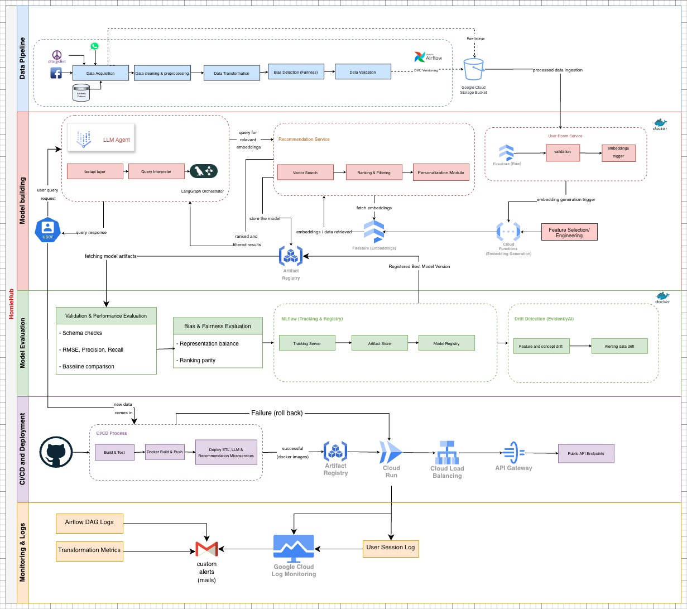

# HomieHub – System Design Documentation

**HomieHub** is an intelligent housing recommendation platform built on a **5-lane microservices architecture** hosted on **Google Cloud Platform (GCP)**. The system ingests, cleans, and processes housing data, generates embeddings, provides personalized recommendations, monitors data drift, and automatically retrains models as needed.

---

## Table of Contents

* [Architecture Overview](#architecture-overview)
* [Lane-by-Lane Breakdown](#lane-by-lane-breakdown)
* [Tech Stack](#tech-stack)
* [Automated Retraining & Alerts](#automated-retraining--alerts)
* [Directory Structure](#directory-structure)

---

## Architecture Overview



The HomieHub architecture is designed to handle **end-to-end ML operations** in a scalable, automated, and cloud-native manner. It consists of **five horizontal lanes**, each representing a core system function:

1. **Data Pipeline (ETL)** – ingestion, preprocessing, validation, and storage
2. **Model Building** – LLM agent, recommendation engine, feature store
3. **Model Evaluation** – QA, metrics, fairness checks, drift detection
4. **CI/CD & Deployment** – automated build, containerization, deployment
5. **Monitoring & Logging** – observability, alerting via SMTP emails, system health

The system is orchestrated to enable reproducible ML workflows, fairness-aware recommendations, and automated retraining in response to data drift.

---

## Lane-by-Lane Breakdown

### 1. Data Pipeline (ETL)

* **Inputs:** Craigslist, Facebook, WhatsApp, Synthetic Dataset
* **Process:** Data Acquisition → Cleaning & Preprocessing → Transformation → Bias Detection → Validation
* **Tools:** Apache Airflow (Orchestration), DVC (Versioning)
* **Output:** Processed data stored in **GCP Buckets**

### 2. Model Building

* **LLM Agent:** FastAPI → Query Interpreter → LangGraph Orchestrator
* **Recommendation Engine:** Vector Search → Ranking & Filtering → Personalization Module
* **Feature Store:** Cloud Functions generate embeddings, stored in **Firestore**
* **Artifacts:** Stored in **Google Artifact Registry** for versioned reproducibility

### 3. Model Evaluation

* **Metrics:** RMSE, Precision, Recall
* **Bias & Fairness:** Representation balance, ranking parity
* **Experiment Tracking:** MLflow for metrics, model registry, and artifact tracking
* **Drift Detection:** EvidentlyAI monitors feature and concept drift

### 4. CI/CD & Deployment

* **Trigger:** GitHub Actions (automated on push or new data)
* **Pipeline Steps:** Build & Test → Docker Build → Push → Deploy to Cloud Run
* **Traffic Management:** Cloud Load Balancing & API Gateway
* **Failure Handling:** Automatic rollback in case of pipeline errors

### 5. Monitoring & Logging

* **Aggregated Logs:** Airflow DAG logs, transformation metrics, user session logs
* **Alerts/Notifications:** SMTP emails are sent when:

  * Data drift is detected by EvidentlyAI
  * ETL or model pipelines fail
* **Observability:** Centralized logging ensures system health monitoring

---

## Tech Stack

| Component               | Tool / Technology                         |
| ----------------------- | ----------------------------------------- |
| Cloud Deployment        | GCP (Cloud Run, Cloud Functions)          |
| Orchestration           | Apache Airflow, LangGraph                 |
| MLOps & Experimentation | MLflow, DVC, EvidentlyAI                  |
| Model Interface         | FastAPI                                   |
| Containerization        | Docker                                    |
| Storage                 | Firestore, GCS Buckets, Artifact Registry |
| Bias & Fairness         | Fairlearn                                 |
| Alerts/Notifications    |  Email                                |

---

## Automated Retraining & Alerts

1. **Drift Monitoring:** EvidentlyAI continuously tracks feature and concept drift.
2. **Alert Trigger:** If drift or pipeline failures occur:

   * SMTP email notification is sent to the configured recipients
   * Alert contains details of the metric drift or error logs
3. **Retraining Trigger:** The same alert webhook triggers the Airflow DAG to start automated retraining.
4. **Retraining Workflow:** Airflow orchestrates:

   * ETL pipeline → Embedding Generation → Model Training → Evaluation
5. **Deployment:** Successful models are automatically deployed to Cloud Run.
6. **Logging & Tracking:** MLflow stores metrics, artifacts, and retraining versions.

This ensures the system **responds proactively to drift or failures**, maintains high-quality recommendations, and keeps stakeholders informed via email.

---

## Directory Structure

```
homiehub/
├── data-pipeline/
│   ├── dags/
│   ├── src/
│   ├── pipelines/
│   ├── logs/
│   ├── config/
│   └── tests/
├── model-pipeline/
│   ├── llm-agent/
│   ├── recommendation-service/
│   ├── user-room-service/
│   └── experiments/
├── gcloud/
├── requirements.txt
└── homiehub_sysdesign.jpg
```
